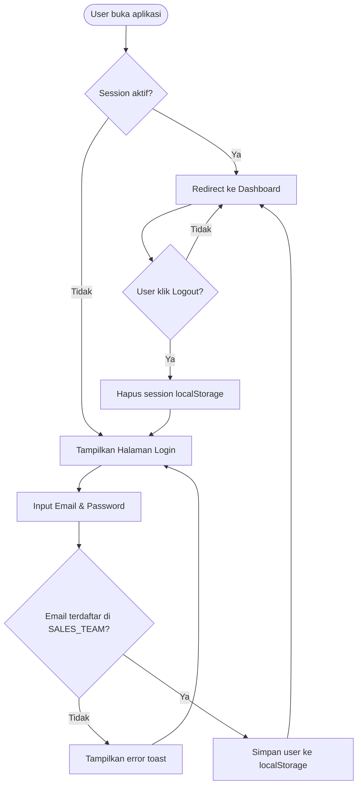
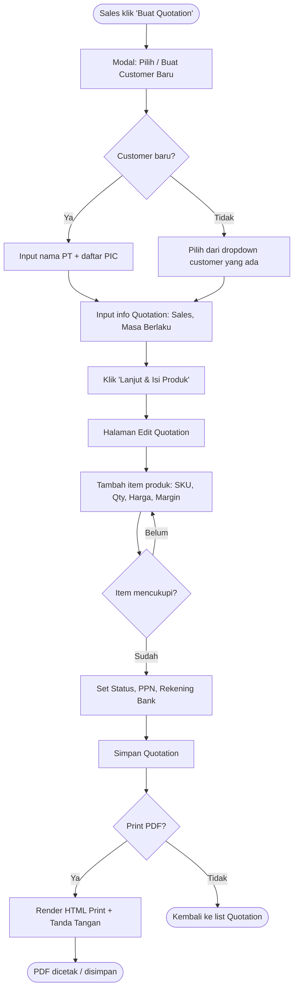
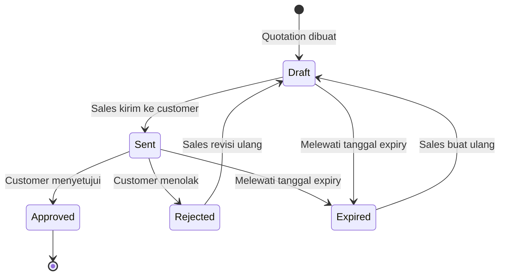
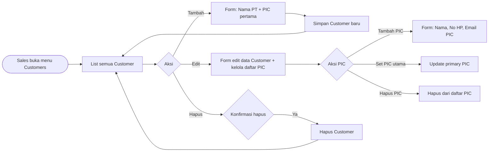
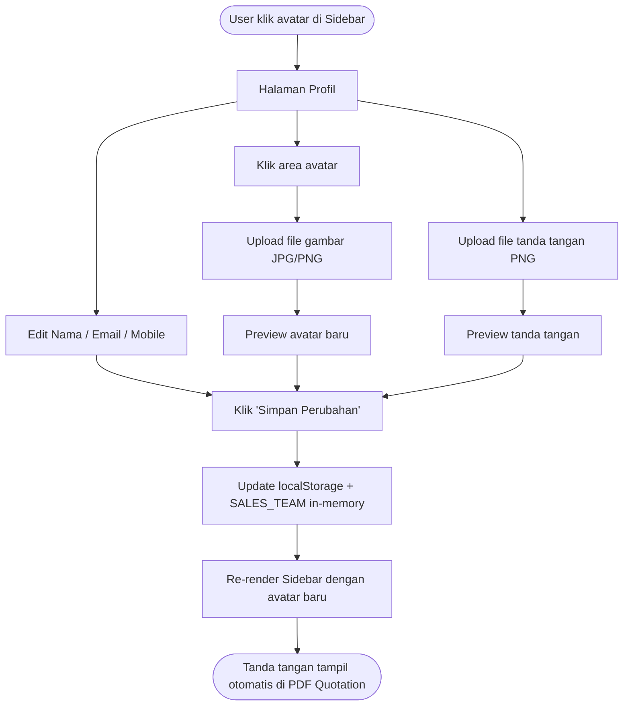
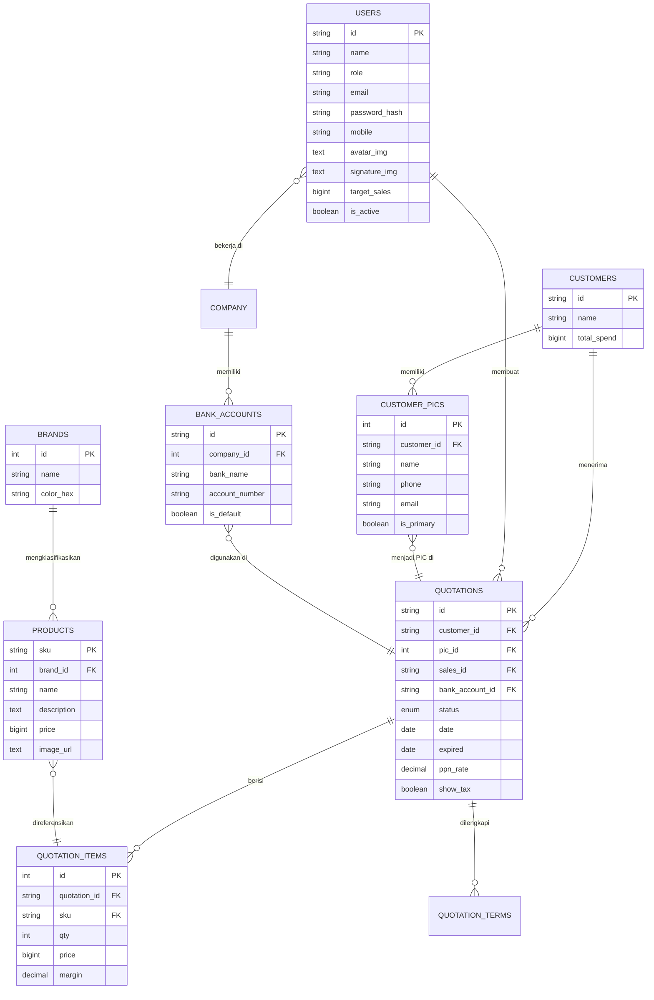

# PRD — ACTiV Quotation Sales Portal

## 1. Overview

**Nama Produk:** ACTiV Sales Portal  
**Tipe Aplikasi:** Web-based Single Page Application (SPA) – Internal Sales Tool  
**Tujuan:** Sistem terpadu untuk manajemen penawaran harga (Quotation), pelanggan, produk, dan kinerja tim sales PT. Alfa Cipta Teknologi Virtual (ACTiV).

---

## 2. User Roles

| Role                     | Akses                                                        |
| ------------------------ | ------------------------------------------------------------ |
| **Sales Manager**        | Full access: semua quotation, analytics, settings, tim sales |
| **Account Executive**    | Akses quotation milik sendiri, customers, products           |
| **Sales Representative** | Akses quotation milik sendiri, customers, products           |

> [!NOTE]
> Saat ini autentikasi hanya berdasarkan email (tanpa password enforcement). Untuk production, harus ditambahkan hashing dan JWT.

---

## 3. Modul & Fitur

| Modul            | Fitur                                                                              |
| ---------------- | ---------------------------------------------------------------------------------- |
| **Auth / Login** | Login dengan email + password, quick-select akun demo, session via localStorage    |
| **Dashboard**    | KPI ringkasan, chart revenue bulanan, daftar quotation terbaru, performa per sales |
| **Quotations**   | Buat / edit / hapus / duplikat quotation, filter status & search, print PDF        |
| **Customers**    | CRUD pelanggan + multi-PIC, riwayat transaksi                                      |
| **Products**     | CRUD produk per brand, upload gambar produk                                        |
| **Brands**       | Manajemen brand/kategori produk                                                    |
| **Analytics**    | Chart revenue, win-rate, performa per sales, top customer & brand                  |
| **Settings**     | Info perusahaan, rekening bank, manajemen tim sales (tambah/hapus)                 |
| **Profile**      | Edit info akun login, upload foto profil, upload tanda tangan digital              |

---

## 4. Flow Diagram

### 4.1 Authentication Flow

### 4.2 Quotation Creation Flow

### 4.3 Quotation Status Lifecycle

### 4.4 Customer & PIC Management Flow

### 4.5 Profile & Signature Flow

---

## 5. Database Schema

> [!IMPORTANT]
> Saat ini semua data disimpan **in-memory** di `data.js` + **localStorage** untuk sesi & profil. Schema berikut adalah rancangan untuk migrasi ke database relasional (PostgreSQL / MySQL).

---

### Tabel `users` (Tim Sales)

| Kolom             | Tipe         | Constraint       | Keterangan                                               |
| ----------------- | ------------ | ---------------- | -------------------------------------------------------- |
| `id`              | VARCHAR(10)  | PK               | Contoh: `S001`                                           |
| `name`            | VARCHAR(100) | NOT NULL         | Nama lengkap                                             |
| `role`            | VARCHAR(50)  | NOT NULL         | Sales Manager / Account Executive / Sales Representative |
| `email`           | VARCHAR(100) | UNIQUE, NOT NULL | Email login                                              |
| `password_hash`   | VARCHAR(255) | NOT NULL         | Bcrypt hash                                              |
| `mobile`          | VARCHAR(20)  |                  | Nomor HP                                                 |
| `avatar_initials` | VARCHAR(5)   |                  | Inisial nama (2 huruf)                                   |
| `avatar_img`      | TEXT         | NULLABLE         | Base64 / URL foto profil                                 |
| `signature_img`   | TEXT         | NULLABLE         | Base64 / URL tanda tangan                                |
| `target_sales`    | BIGINT       | DEFAULT 0        | Target penjualan (IDR)                                   |
| `achieved_sales`  | BIGINT       | DEFAULT 0        | Total penjualan tercapai                                 |
| `is_active`       | BOOLEAN      | DEFAULT true     | Status aktif/nonaktif                                    |
| `created_at`      | TIMESTAMP    | DEFAULT NOW()    |                                                          |
| `updated_at`      | TIMESTAMP    |                  |                                                          |

---

### Tabel `customers`

| Kolom         | Tipe         | Constraint    | Keterangan            |
| ------------- | ------------ | ------------- | --------------------- |
| `id`          | VARCHAR(10)  | PK            | Contoh: `C001`        |
| `name`        | VARCHAR(150) | NOT NULL      | Nama perusahaan / PT  |
| `total_spend` | BIGINT       | DEFAULT 0     | Total nilai transaksi |
| `created_at`  | TIMESTAMP    | DEFAULT NOW() |                       |
| `updated_at`  | TIMESTAMP    |               |                       |

---

### Tabel `customer_pics` (Person in Charge)

| Kolom         | Tipe         | Constraint        | Keterangan |
| ------------- | ------------ | ----------------- | ---------- |
| `id`          | SERIAL       | PK                |            |
| `customer_id` | VARCHAR(10)  | FK → customers.id |            |
| `name`        | VARCHAR(100) | NOT NULL          | Nama PIC   |
| `phone`       | VARCHAR(30)  |                   | Nomor HP   |
| `email`       | VARCHAR(100) |                   | Email PIC  |
| `is_primary`  | BOOLEAN      | DEFAULT false     | PIC utama  |
| `created_at`  | TIMESTAMP    | DEFAULT NOW()     |            |

---

### Tabel `brands`

| Kolom        | Tipe         | Constraint       | Keterangan        |
| ------------ | ------------ | ---------------- | ----------------- |
| `id`         | SERIAL       | PK               |                   |
| `name`       | VARCHAR(100) | UNIQUE, NOT NULL | Nama brand        |
| `color_hex`  | VARCHAR(10)  |                  | Warna badge brand |
| `created_at` | TIMESTAMP    | DEFAULT NOW()    |                   |

---

### Tabel `products`

| Kolom         | Tipe         | Constraint     | Keterangan         |
| ------------- | ------------ | -------------- | ------------------ |
| `sku`         | VARCHAR(30)  | PK             | Kode produk unik   |
| `brand_id`    | INT          | FK → brands.id |                    |
| `name`        | VARCHAR(200) | NOT NULL       | Nama produk        |
| `description` | TEXT         |                | Deskripsi panjang  |
| `price`       | BIGINT       | NOT NULL       | Harga satuan (IDR) |
| `image_url`   | TEXT         | NULLABLE       | URL gambar produk  |
| `is_active`   | BOOLEAN      | DEFAULT true   |                    |
| `created_at`  | TIMESTAMP    | DEFAULT NOW()  |                    |
| `updated_at`  | TIMESTAMP    |                |                    |

---

### Tabel `quotations`

| Kolom             | Tipe         | Constraint            | Keterangan                                         |
| ----------------- | ------------ | --------------------- | -------------------------------------------------- |
| `id`              | VARCHAR(20)  | PK                    | Format: `QO5.0726.036`                             |
| `customer_id`     | VARCHAR(10)  | FK → customers.id     |                                                    |
| `pic_id`          | INT          | FK → customer_pics.id | PIC terpilih untuk QO ini                          |
| `sales_id`        | VARCHAR(10)  | FK → users.id         | Sales pembuat                                      |
| `bank_account_id` | VARCHAR(20)  | FK → bank_accounts.id | Rekening tujuan                                    |
| `status`          | ENUM         | NOT NULL              | `draft`, `sent`, `approved`, `rejected`, `expired` |
| `date`            | DATE         | NOT NULL              | Tanggal dibuat                                     |
| `expired`         | DATE         | NOT NULL              | Tanggal kedaluwarsa                                |
| `calc_tax`        | BOOLEAN      | DEFAULT true          | Apakah harga sudah termasuk PPN                    |
| `show_tax`        | BOOLEAN      | DEFAULT true          | Tampilkan baris PPN di PDF                         |
| `ppn_rate`        | DECIMAL(5,4) | DEFAULT 0.11          | Tarif PPN (11%)                                    |
| `notes`           | TEXT         | NULLABLE              | Catatan internal                                   |
| `created_at`      | TIMESTAMP    | DEFAULT NOW()         |                                                    |
| `updated_at`      | TIMESTAMP    |                       |                                                    |

---

### Tabel `quotation_items`

| Kolom          | Tipe         | Constraint         | Keterangan                             |
| -------------- | ------------ | ------------------ | -------------------------------------- |
| `id`           | SERIAL       | PK                 |                                        |
| `quotation_id` | VARCHAR(20)  | FK → quotations.id |                                        |
| `sku`          | VARCHAR(30)  | FK → products.sku  |                                        |
| `qty`          | INT          | NOT NULL           | Jumlah unit                            |
| `price`        | BIGINT       | NOT NULL           | Harga saat quotation dibuat (snapshot) |
| `margin`       | DECIMAL(5,2) | NULLABLE           | Margin % jika ada                      |
| `sort_order`   | INT          | DEFAULT 0          | Urutan tampil                          |

---

### Tabel `quotation_terms`

| Kolom          | Tipe        | Constraint         | Keterangan              |
| -------------- | ----------- | ------------------ | ----------------------- |
| `id`           | SERIAL      | PK                 |                         |
| `quotation_id` | VARCHAR(20) | FK → quotations.id |                         |
| `term_text`    | TEXT        | NOT NULL           | Teks syarat & ketentuan |
| `sort_order`   | INT         | DEFAULT 0          | Urutan tampil           |

---

### Tabel `company`

| Kolom            | Tipe         | Constraint | Keterangan           |
| ---------------- | ------------ | ---------- | -------------------- |
| `id`             | SERIAL       | PK         |                      |
| `name`           | VARCHAR(200) | NOT NULL   | Nama PT              |
| `brand`          | VARCHAR(50)  |            | Nama brand singkat   |
| `address_hq`     | TEXT         |            | Alamat kantor pusat  |
| `address_branch` | TEXT         |            | Alamat kantor cabang |
| `phone`          | VARCHAR(30)  |            |                      |
| `email`          | VARCHAR(100) |            |                      |
| `website`        | VARCHAR(100) |            |                      |
| `logo_url`       | TEXT         | NULLABLE   | URL logo perusahaan  |
| `updated_at`     | TIMESTAMP    |            |                      |

---

### Tabel `bank_accounts`

| Kolom            | Tipe         | Constraint      | Keterangan       |
| ---------------- | ------------ | --------------- | ---------------- |
| `id`             | VARCHAR(20)  | PK              | Contoh: `bca-1`  |
| `company_id`     | INT          | FK → company.id |                  |
| `bank_name`      | VARCHAR(50)  | NOT NULL        | Nama bank        |
| `account_number` | VARCHAR(50)  | NOT NULL        | Nomor rekening   |
| `account_name`   | VARCHAR(200) | NOT NULL        | Atas nama        |
| `is_default`     | BOOLEAN      | DEFAULT false   | Rekening default |
| `created_at`     | TIMESTAMP    | DEFAULT NOW()   |                  |

---

## 6. Entity Relationship (ERD)

---

## 7. Rekomendasi Stack untuk Production

| Layer                | Teknologi yang Direkomendasikan                       |
| -------------------- | ----------------------------------------------------- |
| **Frontend**         | Vite + React atau Vue 3 (migrasi dari vanilla JS)     |
| **Backend API**      | Node.js (Express) atau Go (Fiber)                     |
| **Database**         | PostgreSQL                                            |
| **Auth**             | JWT + Refresh Token + bcrypt                          |
| **Storage (Gambar)** | Cloudinary atau AWS S3 (gantikan Base64 localStorage) |
| **PDF Generation**   | Puppeteer (server-side) atau React-PDF                |
| **Hosting**          | Vercel (FE) + Railway / Render (BE)                   |

---

_Dokumen ini dihasilkan berdasarkan analisa codebase ACTiV Quotation Portal versi mockup per Agustus 2026._
