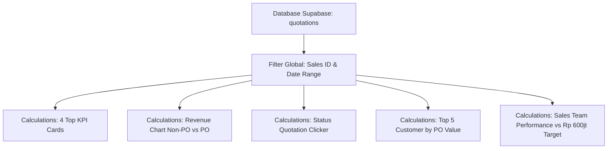

# PRD — Update Halaman Dashboard (ACTiV Sales Portal)

## 1. Overview & Tujuan

**Nama Fitur:** Dashboard Page Update & Enhancement  
**Target Modul:** `Dashboard.jsx`  
**Sasaran:** Mengubah halaman Dashboard menjadi pusat kontrol utama (_command center_) yang kaya visual, presisi secara analisis finansial, serta memfasilitasi pengambilan keputusan strategis bagi **Sales Manager** dan **Tim Sales (AE / Reps)**.

---

## 2. User Roles & Hak Akses

| Role                                   | Akses & Filter Dashboard                                                                                                                                                                   |
| :------------------------------------- | :----------------------------------------------------------------------------------------------------------------------------------------------------------------------------------------- |
| **Sales Manager / Admin**              | Full Access: Dapat melihat semua data, memfilter per individu Sales atau **All Sales**, mengatur **Target Sales (Default: Rp 600jt)**, serta melakukan filter status quotation interaktif. |
| **Account Executive / Representative** | Restricted Access: Data yang ditampilkan otomatis terfilter khusus untuk Quotation milik sales yang sedang login.                                                                          |

---

## 3. Spesifikasi Rinci Fitur & Komponen Dashboard

### 3.1 4 Top KPI Metric Cards (Kartu Ringkasan Utama)

Empat kartu KPI ditempatkan di bagian atas halaman dengan tampilan visual premium:

1. **Total Quotation**
   - **Deskripsi:** Jumlah total penawaran (quotation) yang diterbitkan.
   - **Formula:** `COUNT(quotations)` berdasarkan filter sales & periode aktif.

2. **Value All Quotation**
   - **Deskripsi:** Total akumulasi nilai nominal (IDR) dari seluruh penawaran harga.
   - **Formula:** `SUM(grand_total)` dari seluruh quotation tanpa memandang status.
   - **Format:** Ringkas (contoh: `Rp 2.4M` atau `Rp 850jt`) dengan tooltip format lengkap IDR.

3. **PO Status (Total PO / Approved Value)**
   - **Deskripsi:** Ringkasan quotation yang sudah berhasil mencapai tahap PO (Status: `approved`).
   - **Komponen Data:**
     - Jumlah berkas PO (`COUNT(quotations WHERE status = 'approved')`).
     - Akumulasi nominal rupiah PO (`SUM(grand_total WHERE status = 'approved')`).

4. **Conversion Rate**
   - **Deskripsi:** Rasio persentase keberhasilan pengubahan penawaran menjadi PO resmi.
   - **Formula:** `(Total Count PO Approved / Total Count Quotation) * 100%`
   - **Visual:** Progress ring / persentase dengan warna dinamik (Hijau: >30%, Kuning: 15-30%, Merah: <15%).

---

### 3.2 System Filter Data Quotation

Sistem filter global berada di bagian atas dashboard untuk mengontrol seluruh widget data secara real-time:

- **Filter Sales Person:**
  - Dropdown berisi seluruh anggota Tim Sales (`All Sales` vs `Spesifik Sales`).
  - _Khusus Manager/Admin:_ Dapat berganti antar Sales secara instan.
- **Filter Periode / Tanggal (Date Range):**
  - **Presets Quick Button:** `1 Bulan`, `3 Bulan`, `6 Bulan (Default)`, `12 Bulan / Max 1 Year`.
  - **Custom Range:** Custom Month Selector & Custom Date Range Picker (Start Date - End Date).

---

### 3.3 Chart "Revenue Quotation" (Komparasi Non-PO vs PO)

Grafik komparasi pendapatan bulanan untuk menganalisis rasio konversi finansial:

- **Tipe Chart:** Stacked Bar Chart atau Dual-Series Column Chart.
- **Data Series:**
  1. **Total Revenue PO (`status = 'approved'`):** Diwakili warna Hijau Emerald.
  2. **Total Revenue Non-PO (`status != 'approved'` / All kecuali PO):** Diwakili warna Biru/Abu-abu (meliputi Draft, Sent, Rejected, Expired).
- **Timeframe & Controls:**
  - Default: **6 Bulan Terakhir**.
  - Opsi Tombol Filter Waktu: `1 Month`, `3 Months`, `6 Months`, `1 Year (12 Months)`, serta `Custom Month / Date`.
- **Interactive Tooltip:** Menampilkan breakdown rincian nilai rupiah PO vs Non-PO ketika bar di-hover.

---

### 3.4 Status Quotation Clicker (Manager Role Interactive Filter)

Visualisasi distribusi status quotation yang dapat diklik (_clickable_) untuk pemantauan cepat oleh Manager:

- **Komponen Badge Status:**
  - `Approved (PO)` — Hijau
  - `Sent` — Biru
  - `Created / Draft` — Abu-abu
  - `Rejected` — Merah
  - `Expired` — Amber/Kuning
- **Fungsionalitas Clicker:**
  - Saat Manager mengklik salah satu card status, halaman akan melakukan filter cepat pada daftar quotation di bawahnya atau mengarahkan ke halaman `Quotations` dengan filter status pre-selected.

---

### 3.5 Top 5 Customer (Berdasarkan Nominal PO)

Tabel/Kard rangkuman 5 Pelanggan Teratas yang memberikan kontribusi nilai transaksi PO terbesar:

- **Urutan (Sorting):** `ORDER BY SUM(approved_quotation_value) DESC LIMIT 5`.
- **Kolom Data:**
  1. Nama Perusahaan / Customer.
  2. Total Berkas PO (`Total PO`).
  3. Total Nominal Kontribusi (IDR).
  4. Persentase Kontribusi terhadap Total Revenue PO.
- **Visual Element:** Avatar/Initial logo perusahaan + bar indikator proporsi.

---

### 3.6 Performa Sales Team & Target Management

Widget khusus pemantauan pencapaian kuota penjualan tim:

- **Baseline Target Sales:**
  - Default Target: **Rp 600.000.000 (600 Juta IDR)** per Sales / Periode.
  - **Custom Target Manager Level:** Manager dapat mengubah/mengatur target individual sales melalui modal pengaturan cepat langsung dari Dashboard atau Settings.
- **Elemen Tampilan:**
  - **Nama Sales & Avatar**
  - **Pencapaian Realisasi PO (Rp)** vs **Target Nominal (Rp 600jt)**
  - **Progress Bar Percentage:** Indikator persentase ketercapaian target.
  - **Status Kinerja:** Label dinamis (contoh: `Exceeded`, `On Track`, `Needs Push`).

---

## 4. Arsitektur Data & Rumus Kalkulasi

### Formulas Summary:

1. `Total Quotation = COUNT(quotations)`
2. `Value All Quotation = SUM(grand_total)`
3. `Total PO Value = SUM(grand_total WHERE status = 'approved')`
4. `Conversion Rate = (COUNT(approved) / COUNT(total)) * 100`
5. `Sales Target Attainment = (SUM(approved_value) / Sales_Target) * 100`

---

## 5. Rencana Implementasi & Checklist Verifikasi

- [ ] **Phase 1:** Refactor state management `Dashboard.jsx` untuk mendukung filter global Sales & Date Range.
- [ ] **Phase 2:** Update 4 Top KPI Cards dengan kalkulasi baru & visualisasi Conversion Rate.
- [ ] **Phase 3:** Buat komponen Grafik Revenue Komparasi (PO vs Non-PO) lengkap dengan tombol filter periode (1M, 3M, 6M, 12M, Custom Date).
- [ ] **Phase 4:** Buat widget Status Quotation Clicker interaktif.
- [ ] **Phase 5:** Buat widget Top 5 Customer berdasarkan nominal PO.
- [ ] **Phase 6:** Buat widget Performa Sales Team dengan fitur penyesuaian target (Rp 600jt default).
- [ ] **Phase 7:** Testing & Verifikasi kalkulasi data dengan dataset Supabase.
