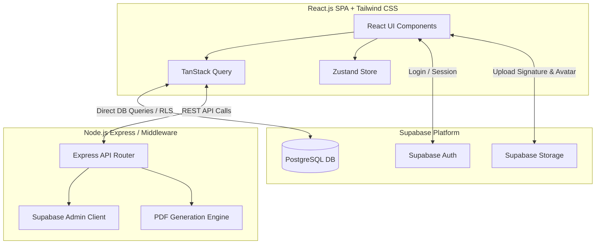
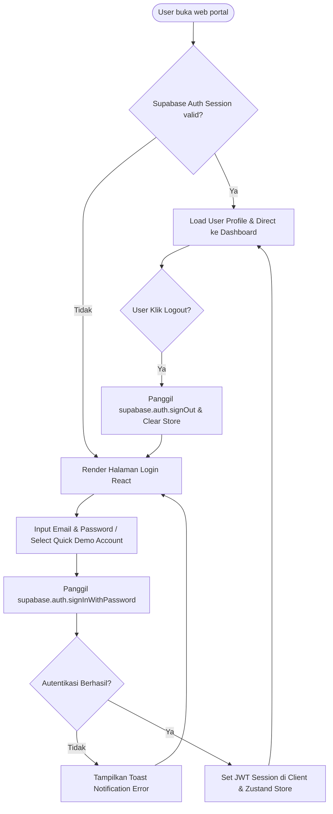
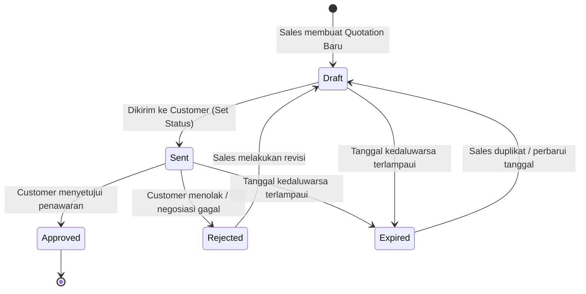
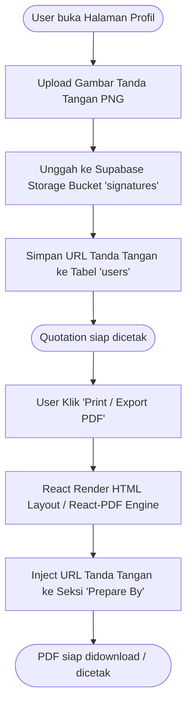
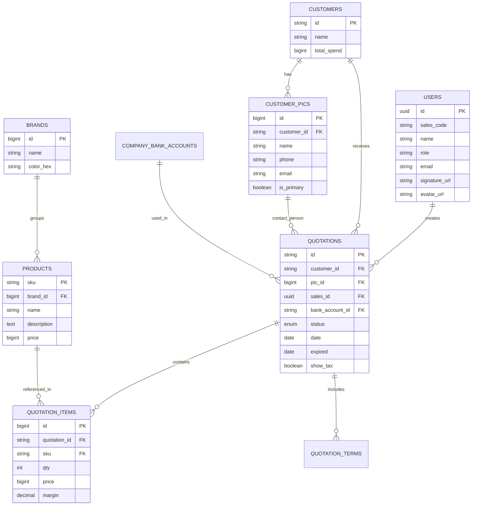

# PRD — ACTiV Quotation Sales Portal (ReactJS + Node.js + Supabase)

## 1. Executive Summary & Technology Stack

**Nama Produk:** ACTiV Sales Portal  
**Tipe Aplikasi:** Web-based Single Page Application (SPA) – Internal Sales Management System  
**Tujuan:** Sistem terpadu untuk manajemen penawaran harga (Quotation), pelanggan, katalog produk, dan analitik kinerja tim sales PT. Alfa Cipta Teknologi Virtual (ACTiV).

### Tech Stack Definitive

- **Frontend Framework:** React.js (Vite + React 18)
- **Styling & UI:** Tailwind CSS (Vanilla CSS custom utility tokens, dark/light harmonious tones, responsive glassmorphism)
- **State & Data Fetching:** TanStack Query (React Query v5) + Zustand (Global UI State)
- **Backend API & Service:** Node.js (Express.js / Fastify) + Supabase Client (`@supabase/supabase-js`)
- **Database:** PostgreSQL (Managed via Supabase)
- **Authentication:** Supabase Auth (JWT + Row Level Security / RLS)
- **File Storage:** Supabase Storage (Bucket for User Avatars & Digital Signatures)
- **PDF Generation:** React-PDF (`@react-pdf/renderer`) & Window Print API Sync

---

## 2. User Roles & Permission Matrix

| Role                     | Akses Modul                                | Deskripsi Otorisasi                                                                                     |
| ------------------------ | ------------------------------------------ | ------------------------------------------------------------------------------------------------------- |
| **Sales Manager**        | Full Access (All Modules)                  | Melihat semua quotation tim, mengelola target sales, kelola brand & rekening bank, kelola anggota sales |
| **Account Executive**    | Dashboard, Quotations, Customers, Products | Kelola quotation & customer milik sendiri, akses katalog produk read-only                               |
| **Sales Representative** | Dashboard, Quotations, Customers, Products | Kelola quotation & customer milik sendiri, akses katalog produk read-only                               |

---

## 3. Architecture & System Flow

### 3.1 Architecture Overview



### 3.2 Authentication Flow



### 3.3 Quotation Lifecycle Flow



### 3.4 Signature & PDF Generation Flow



---

## 4. Module & Feature Specifications

### 4.1 Auth & Session Management

- Login menggunakan Supabase Auth dengan email & password.
- Mendukung Quick Account Switcher untuk kemudahan demo.
- Persistensi sesi menggunakan JWT secure storage & auto-refresh token.

### 4.2 Dashboard Module

- Metric KPI Cards (Total Revenue, Quotations Sent, Approved Rate, Target Realization).
- Interactive Revenue Chart (Recharts / Chart.js) berbasis agregasi PostgreSQL.
- Table Quotation Terbaru & Performance Sales Leaderboard.

### 4.3 Quotation Module

- Form Wizard Multi-Step:
  1. Pilih Customer (Existing) atau buat Customer Baru + Multi PIC.
  2. Isi Metadata Quotation (Sales Pembuat, Expiry Days, Bank Account Target).
  3. Detail Produk: Pilih dari Katalog, Input Margin %, Custom Price, Diskonto.
- Kalkulasi Otomatis: Subtotal, PPN 11% (Toggle Show/Hide Tax), Grand Total.
- Fitur Duplikat, Re-order, Export PDF / Print View dengan layout resmi (Header Logo ACTiV & Signature).

### 4.4 Customer & PIC Management

- CRUD Perusahaan Customer.
- One-to-Many Relationship dengan Customer PIC (Nama, No Telp, Email, Status Primary).

### 4.5 Product & Brand Catalog

- Katalog Produk per Brand (Jabra, Logitech, Poly, Yealink, Hikvision).
- CRUD Brand dengan Warna Custom Badge (Hex Color).
- Multiline Description support untuk rincian spesifikasi & isi paket penjualan.

### 4.6 User Profile & Settings

- Informasi Perusahaan & Rekening Bank Resmi (Default Bank Account selector).
- Profile Management: Edit Nama, Mobile, Foto Profil Avatar.
- Digital Signature: File Uploader ke Supabase Storage, di-render otomatis pada dokumen PDF Quotation.

---

## 5. Database Schema (PostgreSQL via Supabase)

### 5.1 Tables & Relations Structure

#### 1. `users` (Extends `auth.users`)

```sql
CREATE TABLE public.users (
  id UUID PRIMARY KEY REFERENCES auth.users(id) ON DELETE CASCADE,
  sales_code VARCHAR(10) UNIQUE NOT NULL, -- e.g., 'S001'
  name VARCHAR(100) NOT NULL,
  role VARCHAR(50) NOT NULL CHECK (role IN ('Sales Manager', 'Account Executive', 'Sales Representative')),
  email VARCHAR(100) UNIQUE NOT NULL,
  mobile VARCHAR(20),
  avatar_initials VARCHAR(5),
  avatar_url TEXT,
  signature_url TEXT,
  target_sales BIGINT DEFAULT 0,
  achieved_sales BIGINT DEFAULT 0,
  is_active BOOLEAN DEFAULT true,
  created_at TIMESTAMPTZ DEFAULT NOW(),
  updated_at TIMESTAMPTZ DEFAULT NOW()
);
```

#### 2. `customers`

```sql
CREATE TABLE public.customers (
  id VARCHAR(10) PRIMARY KEY, -- e.g., 'C001'
  name VARCHAR(150) NOT NULL,
  total_spend BIGINT DEFAULT 0,
  created_at TIMESTAMPTZ DEFAULT NOW(),
  updated_at TIMESTAMPTZ DEFAULT NOW()
);
```

#### 3. `customer_pics`

```sql
CREATE TABLE public.customer_pics (
  id BIGSERIAL PRIMARY KEY,
  customer_id VARCHAR(10) REFERENCES public.customers(id) ON DELETE CASCADE,
  name VARCHAR(100) NOT NULL,
  phone VARCHAR(30),
  email VARCHAR(100),
  is_primary BOOLEAN DEFAULT false,
  created_at TIMESTAMPTZ DEFAULT NOW()
);
```

#### 4. `brands`

```sql
CREATE TABLE public.brands (
  id BIGSERIAL PRIMARY KEY,
  name VARCHAR(100) UNIQUE NOT NULL,
  color_hex VARCHAR(10) NOT NULL DEFAULT '#6B7280',
  created_at TIMESTAMPTZ DEFAULT NOW()
);
```

#### 5. `products`

```sql
CREATE TABLE public.products (
  sku VARCHAR(30) PRIMARY KEY,
  brand_id BIGINT REFERENCES public.brands(id) ON DELETE RESTRICT,
  name VARCHAR(200) NOT NULL,
  description TEXT,
  price BIGINT NOT NULL,
  image_url TEXT,
  is_active BOOLEAN DEFAULT true,
  created_at TIMESTAMPTZ DEFAULT NOW(),
  updated_at TIMESTAMPTZ DEFAULT NOW()
);
```

#### 6. `company_bank_accounts`

```sql
CREATE TABLE public.company_bank_accounts (
  id VARCHAR(20) PRIMARY KEY, -- e.g., 'bca-1'
  bank_name VARCHAR(50) NOT NULL,
  account_number VARCHAR(50) NOT NULL,
  account_name VARCHAR(200) NOT NULL,
  is_default BOOLEAN DEFAULT false,
  created_at TIMESTAMPTZ DEFAULT NOW()
);
```

#### 7. `quotations`

```sql
CREATE TYPE quotation_status AS ENUM ('draft', 'sent', 'approved', 'rejected', 'expired');

CREATE TABLE public.quotations (
  id VARCHAR(20) PRIMARY KEY, -- e.g., 'QO5.0726.036'
  customer_id VARCHAR(10) REFERENCES public.customers(id),
  pic_id BIGINT REFERENCES public.customer_pics(id),
  sales_id UUID REFERENCES public.users(id),
  bank_account_id VARCHAR(20) REFERENCES public.company_bank_accounts(id),
  status quotation_status DEFAULT 'draft',
  date DATE NOT NULL DEFAULT CURRENT_DATE,
  expired DATE NOT NULL,
  calc_tax BOOLEAN DEFAULT true,
  show_tax BOOLEAN DEFAULT true,
  ppn_rate DECIMAL(5,4) DEFAULT 0.11,
  notes TEXT,
  created_at TIMESTAMPTZ DEFAULT NOW(),
  updated_at TIMESTAMPTZ DEFAULT NOW()
);
```

#### 8. `quotation_items`

```sql
CREATE TABLE public.quotation_items (
  id BIGSERIAL PRIMARY KEY,
  quotation_id VARCHAR(20) REFERENCES public.quotations(id) ON DELETE CASCADE,
  sku VARCHAR(30) REFERENCES public.products(sku),
  qty INT NOT NULL CHECK (qty > 0),
  price BIGINT NOT NULL, -- Historical price snapshot
  margin DECIMAL(5,2) DEFAULT 0,
  sort_order INT DEFAULT 0
);
```

#### 9. `quotation_terms`

```sql
CREATE TABLE public.quotation_terms (
  id BIGSERIAL PRIMARY KEY,
  quotation_id VARCHAR(20) REFERENCES public.quotations(id) ON DELETE CASCADE,
  term_text TEXT NOT NULL,
  sort_order INT DEFAULT 0
);
```

---

## 6. Entity Relationship Diagram (ERD)



---

## 7. Migration & Implementation Strategy

1. **Step 1: Setup Supabase Project**
   - Jalankan DDL SQL script di atas pada Supabase SQL Editor.
   - Buat Storage Bucket `avatars` dan `signatures` dengan opsi Public.
2. **Step 2: Frontend Migration (React + Vite)**
   - Inisialisasi Vite + React App (`npm create vite@latest`).
   - Salin file CSS & Tailwind Config tanpa mengubah nama class agar style 100% konsisten.
   - Pecah halaman `src/pages/` dari HTML template string menjadi React Functional Components.
3. **Step 3: Integration (Supabase Client & Node.js Middleware)**
   - Pasang `@supabase/supabase-js`.
   - Implementasikan TanStack Query untuk mutasi data realtime dan automatic revalidation.

---

_PRD ini disusun khusus untuk transisi arsitektur dari Prototype Vanilla JS menuju Production Stack (React.js + Node.js + Supabase)._
